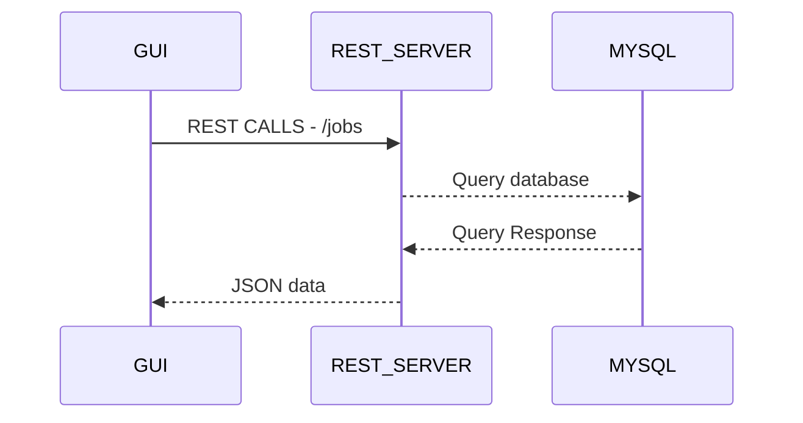

# Simple Jobportal !

## Technologies Used

* GUI - HTML5, BootStrap, jQuery, datatable
* Server - Python 3.7 (Bottle framework)
* Database - MySQL

Demo: http://snivas.pythonanywhere.com/ui/index.html
Deployed on pythonanywhere

## Design

The front end GUI interacts with backend using REST APIs

## Database Design

## REST API cURL samples

#### Jobs - To fetch job details
curl http://snivas.pythonanywhere.com/jobs
curl http://snivas.pythonanywhere.com/jobs?status=open
curl http://snivas.pythonanywhere.com/jobs?status=open&q=test

#### Shortlisted - To fetch Shortlisted applications
curl http://snivas.pythonanywhere.com/jobs/#jobid/shortlisted
curl http://snivas.pythonanywhere.com/jobs/1/shortlisted

#### Interviews - To fetch scheduled interviews for the applicant
curl http://snivas.pythonanywhere.com/jobs/#jobid/interviews/#candidateid
curl http://snivas.pythonanywhere.com/jobs/1/interviews/1

